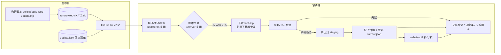

# Aurora Gallery 前端热更新方案设计

> 状态：方案设计稿（待评审）
> 日期：2026-08-08
> 目标版本：v1.1.4+

---

## 1. 背景与目标

### 1.1 现状

应用已具备完整的"整包更新"能力（详见 `UPDATE_CHECKER_IMPLEMENTATION.md`）：

| 能力 | 现状 | 所在位置 |
|---|---|---|
| 版本检查 | ✅ 三层降级策略（API latest → API list → 网页抓取） | `src-tauri/src/updater.rs` |
| 安装包下载 | ✅ 断点续传、暂停/恢复/取消、进度事件 | `src-tauri/src/update_downloader.rs` |
| 安装 | ✅ 下载完成后拉起 NSIS 安装程序 | `update_downloader.rs::install_update` |
| 前端 UI | ✅ 更新弹窗、关于页检查按钮、忽略版本 | `src/hooks/useUpdateCheck.ts`、`UpdateModal.tsx` |

### 1.2 问题

当前"更新"体验：下载完整安装包（内置 CLIP/ONNX 模型，体积大）→ 退出应用 → 运行 NSIS → 重装 → 重启。**哪怕只改了一行前端代码，用户也要走一遍完整重装流程。**

### 1.3 目标

- 纯前端改动（React/TS/CSS）走**热更新**：只下载几百 KB ~ 几 MB 的 web 资源包，替换后刷新界面即生效，**无需退出应用、无需重装**。
- Rust 后端改动仍走现有整包更新流程。
- 复用现有检查、下载、UI 基础设施，改造量最小化。

### 1.4 范围界定（重要约定）

**热更新只能加载"老版本 Rust 中已存在的命令与权限"。** 热更前端不得 invoke 新版本的 Rust 命令；新增 Rust 命令/权限必须走整包更新。否则会出现白屏/调用失败。这是热更新体系的安全边界。

---

## 2. 总体架构



关键链路一句话：**远端发布 web 资源包 → 客户端检查到版本差 → 下载+校验+解压 → 原子替换本地目录 → 刷新 webview 生效。**

---

## 3. 关键技术决策

### 3.1 版本清单 `update.json`（新增）

发布时随 web zip 一起上传到 GitHub Release 资产，应用通过 GitHub API 拿到资产 URL 后拉取：

```json
{
  "schema": 1,
  "version": "1.1.4",
  "kind": "web",
  "web": {
    "url": "https://github.com/misakimiku2/aurora-gallery-tauri/releases/download/v1.1.4/aurora-web-v1.1.4.zip",
    "sha256": "9f86d081884c7d659a2feaa0c55ad015a3bf4f1b2b0b822cd15d6c15b0f00a08",
    "size": 1234567
  },
  "min_app_version": "1.1.0",
  "notes": "修复列表页卡顿；新增筛选器"
}
```

字段说明：

| 字段 | 说明 |
|---|---|
| `kind` | `"web"`（热更）/ `"full"`（整包）。决定客户端走哪条通道 |
| `min_app_version` | 本 web 包要求的最低 Rust 版本（防止热更到旧壳上白屏）。客户端低于此版本时强制走整包更新 |
| `sha256` | web zip 完整性校验值，下载后必须校验 |
| `notes` | 更新说明，直接复用在现有 UpdateModal |

**判定规则（优先级从高到低）**：检查到新 Release 后——

1. Release 资产含 `*_setup.exe` / `*.msi` 且 `min_app_version` 要求 > 当前版本 → 走**整包**（现状流程）
2. 资产含 `aurora-web-*.zip` 且 `min_app_version <= 当前版本` → 走**热更新**
3. 两者都有 → 弹窗给用户两个选项（"快速更新（不重装）" / "下载完整安装包"）

### 3.2 热更前端如何被加载（核心）

**背景**：生产构建时前端资源 `dist/` 被内嵌进二进制，经 `tauri://localhost` 提供；热更后要改从磁盘（appData）加载，且**不需要重启进程，刷新 webview 即可**。

**推荐方案：asset 协议 + 目录切换**

- 项目已开启 asset 协议且 scope 为 `"**"`（`tauri.conf.json → app.security.assetProtocol`），CSP 已放行 `http://asset.localhost:*`，无需新增 CSP 条目。
- 热更资源解压到 `%LOCALAPPDATA%\com.aurora.gallery\web\<version>\`（跨平台用 `app.path().app_data_dir()`），`web\current.json` 记录当前生效版本。
- 启动时 Rust 读取 `current.json`：无热更记录 → 加载内嵌 `tauri://localhost/index.html`（兜底）；有记录 → 将主窗口 `navigate` 到 `asset://localhost/<webDir绝对路径>/index.html`。
- 热更完成后同理：`apply` 成功后 Rust 端 `navigate` 窗口到新版本 asset URL，前端立即以新代码运行。

**备选方案：自定义协议**（若 asset 协议在 Release 构建下访问 appData 的路径出现 scope 问题）

- 在 Rust 注册 `web://localhost` 协议，从 appData/web 目录读静态文件（`tauri::Builder::register_uri_scheme_protocol`），完全不依赖 asset scope 细节，但需在 CSP `default-src` 追加 `web://localhost`。
- 建议先按推荐方案实现，遇到问题再切换（两方案的目录结构完全一致，切换成本低）。

**前置改造（必须）**：`vite.config.ts` 的 `base: '/'` 会让 `index.html` 内资源引用变成绝对路径，脱离根协议后 404。热更构建必须使用独立配置 `vite.config.web-update.ts`，设置 `base: './'`（相对路径）。生产 `tauri build` 仍用 `base: '/'`，两者互不影响。

### 3.3 下载与校验

- **复用** `update_downloader.rs` 的架构（状态机 + 进度事件 + 暂停/恢复），但 web zip 通常只有几 MB，**简化处理**：新增轻量下载器（`web_downloader.rs`），支持进度事件与失败重试（最多 3 次），不做断点续传（zip 校验失败直接重下）。
- 下载完成后计算 SHA-256 与 `update.json` 比对，**不一致直接丢弃并报错**，防止被篡改/损坏。
- 新增 Rust 依赖：`zip = { version = "2", default-features = false, features = ["deflate"] }`。解压时做 **zip-slip 防护**：拒绝解压路径越出目标目录的条目。

### 3.4 原子替换与回滚

目录结构（appData）：

```
web/
├── current.json          # {"version": "1.1.4", "dir": "v1.1.4"}
├── v1.1.3/               # 旧版本（保留，用于回滚）
└── v1.1.4/               # 当前版本
```

替换流程（`apply_web_update` 命令）：

1. 解压到 `web/.staging/v1.1.4/`
2. 校验关键文件存在：`index.html`
3. `fs::rename(.staging/v1.1.4 → v1.1.4)`（同盘原子操作）
4. 写 `current.json` 指向新版本
5. 触发前端刷新（emit `web-update-applied` 事件 → 前端 reload，或 Rust `navigate`）
6. 失败任一步：删除 staging，保留旧版本，`current.json` 不变

回滚策略：
- **自动回滚**：新版本前端在启动后 N 秒内未收到前端"心跳"（前端加载成功会 emit `web-update-ok`）→ 下次启动自动回退到上一版本并置灰该版本。
- **手动回滚**：设置页"关于"面板提供"回退上一版本"按钮（仅当存在上一版本目录时）。

### 3.5 与现有代码的衔接

| 现有模块 | 复用方式 |
|---|---|
| `updater.rs::SemVer` | 直接复用做版本比对 |
| `updater.rs::process_release` | 扩展：从资产列表中识别 `aurora-web-*.zip` 并返回其 URL/大小 |
| `UpdateDownloader` | 不复用（专用 installer 逻辑），新写轻量下载器；两处共用进度事件命名规范 `*-download-progress` |
| `useUpdateCheck.ts` | 增加 web 更新分支状态，其余逻辑不变 |
| `UpdateModal.tsx` | 增加"快速更新"按钮与热更进度展示 |
| `tauri-bridge.ts` / `types.ts` | 增加新命令封装与 `WebUpdateInfo` 类型 |

---

## 4. 改造点清单（按文件）

### 4.1 Rust 侧

**`src-tauri/Cargo.toml`**
- 新增 `zip = { version = "2", default-features = false, features = ["deflate"] }`

**`src-tauri/src/updater.rs`**
- `GithubReleaseAsset` 无需改动（字段已够）
- `process_release()` 增加：识别 `aurora-web-*.zip` 资产 → `UpdateCheckResult` 增加字段 `web_zip_url: Option<String>`、`web_zip_size: Option<u64>`

**`src-tauri/src/web_updater.rs`（新增）**
- `WebUpdateInfo`（对应 update.json 结构）
- `check_web_update()`：拉取远端 update.json → SemVer 比对 → 返回是否有热更
- `download_web_update()`：轻量下载 + SHA-256 校验 + 进度事件 `web-update-download-progress`
- `apply_web_update()`：解压（zip-slip 防护）→ 校验 index.html → 原子 rename → 写 current.json → emit `web-update-applied`
- `get_web_update_status()`：当前生效版本、是否可回滚、staging 清理
- `rollback_web_update()`：回退上一版本并刷新 webview
- `resolve_web_entry()`：启动时返回应加载的入口 URL（内嵌兜底 or asset URL）
- 心跳：监听前端 `web-update-ok` 事件做自动回滚判定（与 `app_handle` 全局状态关联）

**`src-tauri/src/update_commands.rs`**
- 注册：`check_web_update_command` / `start_web_update_download` / `cancel_web_update_download` / `apply_web_update` / `get_web_update_status` / `rollback_web_update` / `resolve_web_entry`

**`src-tauri/src/lib.rs`（或 `main.rs`）**
- 注册上述命令
- 启动流程：`setup` 中读取 `web/current.json` → 决定主窗口初始 URL（`tauri://localhost/index.html` 或 asset URL）
- 主窗口创建后若为热更模式，使用 `WebviewWindow::navigate` 到 asset URL

### 4.2 前端侧

**`src/types.ts`**
- `WebUpdateInfo { hasUpdate; currentVersion; latestVersion; webZipUrl; webZipSize; notes; minAppVersion }`
- `WebUpdateStatus { activeVersion; previousVersion; canRollback; state }`

**`src/api/tauri-bridge.ts`**
- 封装：`checkWebUpdate` / `startWebUpdateDownload` / `cancelWebUpdateDownload` / `applyWebUpdate` / `getWebUpdateStatus` / `rollbackWebUpdate`

**`src/hooks/useUpdateCheck.ts`**
- 增加 `webUpdateInfo`、`webUpdateStatus`、`webDownloadProgress` 状态
- `checkUpdate()` 中：新版仅含 web zip → 进入热更分支（不弹整包弹窗，改为提示"发现快速更新"）

**`src/components/modals/UpdateModal.tsx`**
- 新增按钮："快速更新"（下载+进度条+完成后自动刷新）/"下载完整安装包"（现有流程）
- 热更完成态："更新完成，正在刷新…"

**`src/components/SettingsModal.tsx`（AboutPanel）**
- 显示当前前端来源（内嵌版/热更版 + 版本号）
- "回退上一版本"按钮（可回滚时）

**`src/main.tsx` / `App.tsx`**
- 监听 `web-update-applied` 事件 → `window.location.reload()`（或按 3.2 由 Rust navigate）

### 4.3 构建与发布

**`scripts/build-web-update.mjs`（新增）**
1. 以 `vite.config.web-update.ts`（`base: './'`）构建 → `dist-web-update/`
2. 打包 `aurora-web-v<version>.zip`
3. 计算 SHA-256、文件大小
4. 生成 `update.json`
5. 输出待上传清单（zip + update.json）

**`vite.config.web-update.ts`（新增）**
- 继承主配置，仅覆盖 `base: './'` 与 `outDir: 'dist-web-update'`

**发布流程（手动/后续可接 CI）**
1. `npm run build && npm run tauri build`（整包，有 Rust 变更时）
2. `node scripts/build-web-update.mjs`（纯前端改动时只需这一步）
3. 上传到 GitHub Release 资产：`aurora-web-vX.Y.Z.zip` + `update.json`
4. Release tag 保持 `vX.Y.Z`（复用现有检查逻辑）

---

## 5. 分阶段实施计划

| 阶段 | 内容 | 验收标准 |
|---|---|---|
| **P0 可行性验证** | 手动验证：Release 构建下 asset 协议能否加载 appData 下的 index.html；`base: './'` 产物在 asset 协议下资源是否全通 | 结论明确，记录到本文档 |
| **P1 构建与发布** | `vite.config.web-update.ts` + `build-web-update.mjs` + 首次发布 v1.1.4 web 包 | 本地 zip 校验、解压后浏览器打开 index.html 正常 |
| **P2 Rust 热更模块** | `web_updater.rs` + 命令注册 + 启动加载决策 + 原子替换 + 回滚 | 从 v1.1.3 热更到 v1.1.4，刷新即生效，无白屏 |
| **P3 前端 UI** | hook 热更分支、UpdateModal 快速更新按钮、AboutPanel 回滚 | 全流程 UI 可用，中英双语 |
| **P4 测试加固** | 断网/校验失败/损坏 zip/回滚/整包+热更并存/心跳回滚 | 测试清单全绿 |
| **P5 可选：Android** | 复用同一套机制，适配移动端路径 | Android 端热更生效 |

---

## 6. 风险与对策

| 风险 | 影响 | 对策 |
|---|---|---|
| asset 协议在 Release 构建下访问 appData 受 scope 限制 | 热更页面加载失败 | P0 先行验证；失败即切自定义协议方案 |
| `base: '/'` 未改造成相对路径 | 热更页面资源 404、白屏 | 热更构建强制用独立配置 `base: './'` |
| 热更前端 invoke 了新版本才有的命令 | 调用失败/白屏 | `min_app_version` 门槛 + 约定（4.1 变更必须整包）+ 心跳回滚兜底 |
| 下载被中断/篡改 | 半包/损坏 | SHA-256 校验 + 失败重试 + staging 隔离 |
| zip 解压路径穿越（zip-slip） | 覆盖任意文件 | 解压时逐条目校验目标路径在 web 目录内 |
| 替换时 webview 持有文件句柄 | 替换失败 | 先解压到 staging，rename 原子替换；Windows 下 webview 不常驻锁文件 |
| GitHub API 限流（沿用现状） | 检查失败 | 现有三层降级策略复用 |
| 用户网络为代理/VPN（沿用现状） | 检查/下载异常 | 复用现状降级；下载失败可重试 |

---

## 7. 测试清单

- [ ] 从 v1.1.3 安装包热更到 v1.1.4 web 包：下载→校验→替换→刷新→新 UI 生效
- [ ] 热更期间断网：下载失败可重试，状态不脏
- [ ] 伪造/损坏 zip：SHA-256 校验拒绝，弹窗提示
- [ ] 恶意 zip 带 `../` 条目：解压被拒绝
- [ ] 新前端启动后心跳超时：下次启动自动回滚到 v1.1.3
- [ ] 手动回滚按钮：v1.1.4 → v1.1.3，正常
- [ ] 新 Release 同时含 setup.exe + web zip：弹窗提供两个入口
- [ ] `min_app_version` 高于当前壳版本：强制走整包
- [ ] 热更后（asset 协议页面）IPC invoke、asset 加载本地图片、缩略图协议全部正常
- [ ] 热更后再整包更新：安装后回落到内嵌前端（current.json 清理/忽略逻辑）
- [ ] 中英双语 UI 文案正确

---

## 8. 待确认问题（评审时讨论）

1. web zip 是否保留在 GitHub Release（走现有免费通道），还是以后迁移到自建/CDN？（涉及国内访问速度）
2. 回滚版本保留策略：保留最近 N=2 个版本目录？（磁盘占用约 2×几 MB，可忽略）
3. 是否需要对热更包做签名？（GitHub Release 走 HTTPS + SHA-256 已能防篡改；如需防"中间人替换清单"可后续加签名，当前不引入）
4. P5 Android 是否纳入本期？

---

## 9. 参考

- 现有实现：`docs/UPDATE_CHECKER_IMPLEMENTATION.md`、`src-tauri/src/updater.rs`、`src-tauri/src/update_downloader.rs`
- Tauri 2 文档：asset 协议 / `WebviewWindow::navigate` / 自定义协议 `register_uri_scheme_protocol`
- Tauri updater 插件（整包静默更新的官方替代方案，需代码签名证书，可作为远期选项）：`tauri-plugin-updater`
